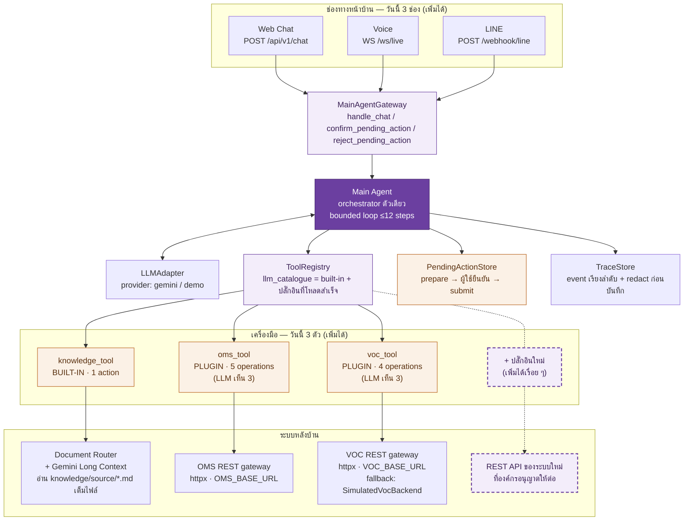

# PEA One Agent — แผนผังการเชื่อมต่อของ Agent (Agent Connectivity Map)

> เอกสารนี้ตอบคำถามเดียว: **"Agent ตัวนี้ต่ออะไรอยู่บ้าง และจะต่อของใหม่เพิ่มยังไง"**
> อ่านจบได้ด้วยตัวเอง ไม่ต้องอ่านเอกสารอื่นก่อน
> ทุกข้อความในเอกสารนี้ตรวจสอบย้อนกลับไปยังโค้ดจริงได้ — ระบุไฟล์ต้นทางกำกับไว้ทุกหัวข้อ
> ตรวจกับโค้ด ณ วันที่จัดทำ: `app/plugins/loader.py`, `app/plugins/manifest.py`, `app/plugins/aliases.py`,
> `app/agent/registry.py`, `app/llm/prompting.py`, `app/plugins/oms/plugin.yaml`, `app/plugins/voc/plugin.yaml`, `scripts/add-plugin`

---

## สรุปหนึ่งย่อหน้า

วันนี้ PEA One Agent มี **สมองเดียว** (Main Agent) ที่รับงานจาก **3 ช่องทางหน้าบ้าน** (Web Chat / Voice / LINE)
และเรียกใช้ **เครื่องมือ 3 ตัว** คือ Knowledge (built-in) + OMS (ปลั๊กอิน) + VOC (ปลั๊กอิน)
ตัวเลข "3 กับ 3" นี้ **ไม่ใช่เพดานของระบบ แต่เป็นสถานะปัจจุบัน** — ทั้งสองฝั่งออกแบบมาให้เพิ่มได้เรื่อยๆ
โดยฝั่งเครื่องมือ การเพิ่มของใหม่คือ **"มี REST API + เขียนไฟล์ `plugin.yaml` หนึ่งไฟล์"** โดยไม่ต้องแก้โค้ดแกนกลางเลย
และช่อง `description` ใน manifest นั้นเอง **คือข้อความที่ถูก compile เข้าแค็ตตาล็อกที่ LLM มองเห็น** ทำให้โมเดลรู้ว่าเมื่อไรควรเรียกเครื่องมือตัวนั้น

---

## 1. แผนผังการเชื่อมต่อวันนี้



**วิธีอ่านสี:** สีม่วง `#6B3FA0` = สมองของระบบและจุดที่ขยายได้ (ของใหม่) / สีอำพัน `#B8631E` = ของที่มีอยู่และทำงานอยู่แล้ววันนี้ /
กล่องเส้นประ = **ยังไม่มีอยู่จริง** เป็น placeholder ที่แสดงตำแหน่งที่ระบบใหม่จะเสียบเข้ามาได้ (ไม่ได้อ้างว่ามีปลั๊กอินตัวที่ 4 แล้ว)

---

## 2. สถานะการเชื่อมต่อวันนี้ (นับจริงจากไฟล์)

### 2.1 เครื่องมือ: built-in 1 + ปลั๊กอิน 2

| เครื่องมือ | ชั้น | ประกอบที่ไหน | operations ทั้งหมด | ที่ LLM มองเห็น | ระบบหลังบ้าน |
|---|---|---|---|---|---|
| `knowledge_tool` | **Built-in** | ประกาศตรงใน `BUILT_IN_CATALOGUE` ที่ `app/agent/registry.py` | 1 (`search`) | 1 | Document Router → Gemini Long Context (อ่านไฟล์ Markdown เต็มไฟล์จาก `knowledge/source/`) |
| `oms_tool` | **Plugin** | `app/plugins/oms/plugin.yaml` | **5** | **3** | OMS REST gateway ผ่าน `httpx` (ตั้งค่าด้วย `OMS_BASE_URL` / `OMS_API_KEY` / `OMS_TIMEOUT_SECONDS`) |
| `voc_tool` | **Plugin** | `app/plugins/voc/plugin.yaml` | **4** | **3** | VOC REST gateway ผ่าน `httpx` (`VOC_BASE_URL` / `VOC_API_KEY` / `VOC_TIMEOUT_SECONDS`) และใช้ `SimulatedVocBackend` ได้เมื่อไม่ระบุ base URL |

รายละเอียด operation ที่ประกาศไว้จริงใน manifest:

```text
oms_tool  (5)  get_outage_by_ca .............. exposure: llm      mode: read
               prepare_outage_with_ca ........ exposure: llm      mode: prepare  → submit_outage_with_ca
               submit_outage_with_ca ......... exposure: internal mode: submit
               prepare_anonymous_outage ...... exposure: llm      mode: prepare  → submit_anonymous_outage
               submit_anonymous_outage ....... exposure: internal mode: submit

voc_tool  (4)  list_categories ............... exposure: llm      mode: read
               prepare_case .................. exposure: llm      mode: prepare  → submit_case
               submit_case ................... exposure: internal mode: submit
               get_case ...................... exposure: llm      mode: read
```

**ทำไม "ที่ LLM มองเห็น" น้อยกว่าจำนวน operation จริง:** ทุก operation ที่เป็น `mode: submit` ถูกบังคับให้เป็น
`exposure: internal` และ `LoadedPlugin.tool_definition` จะใส่เฉพาะ `manifest.llm_actions` (คือ operation ที่
`exposure == llm`) ลงในแค็ตตาล็อก **โมเดลจึงไม่เคยเห็นชื่อ action ที่เขียนข้อมูลจริงเลย** — เรียกไม่ได้แม้จะพยายาม
(บังคับที่ `app/plugins/manifest.py::PluginOperation._check_contracts` และ `app/plugins/loader.py::LoadedPlugin.tool_definition`)

### 2.2 ช่องทางหน้าบ้าน: วันนี้ 3 ช่อง

| ช่องทาง | จุดเชื่อม | หมายเหตุ |
|---|---|---|
| Web Chat | `POST /api/v1/chat` (+ `confirm` / `reject` / `traces` / `reset`) | ตัวเลือกที่ผู้ใช้กดมาจาก catalog ของ backend เท่านั้น |
| Voice | `WS /ws/live` (Gemini Live) | หนึ่ง WebSocket = หนึ่ง session; โมเดลเสียงเห็นฟังก์ชันแค่ 3 ตัวและ **ไม่รับ `pendingActionId`** |
| LINE | `POST /webhook/line` | เปิดใช้เมื่อมี `LINE_CHANNEL_SECRET` + `LINE_CHANNEL_ACCESS_TOKEN`; ตรวจ `X-Line-Signature` ก่อนประมวลผลเสมอ |

ทั้งสามช่องทางเข้าถึง Main Agent ได้ผ่าน `MainAgentGateway` ซึ่งมีเพียง **3 เมทอด** เท่านั้น
(`handle_chat` / `confirm_pending_action` / `reject_pending_action`) และ bridge ของแต่ละช่องทาง
**ไม่แตะ ToolRegistry หรือระบบหลังบ้านโดยตรง** — การเพิ่มช่องทางที่ 4 (เช่น Facebook Messenger, WhatsApp,
หรือระบบโทรศัพท์ของ 1129) จึงเป็นการเขียน bridge ใหม่ที่พูดกับ 3 เมทอดนี้ ไม่ใช่การแก้ business logic

---

## 3. กลไกที่ทำให้ "ต่อของใหม่" ถูก

หัวใจคือ **Main Agent ไม่รู้จักชื่อเครื่องมือล่วงหน้าเลย** มันอ่านรายการเครื่องมือจาก `ToolRegistry.llm_catalogue`
ที่ประกอบขึ้นตอน startup เท่านั้น (`app/agent/registry.py`) — เพิ่มปลั๊กอินใหม่จึงไม่ต้องแตะ Main Agent

### 3.1 สิ่งที่ต้องมีจากฝั่งระบบใหม่: REST API

`app/tools/<id>_tool.py` เป็นชั้นเดียวที่รับผิดชอบ HTTP, authentication และการแปลง payload/error
ระบบใดที่เปิด REST API ให้เรียกได้ ก็ต่อได้ตามรูปแบบเดียวกับ OMS และ VOC ที่ทำอยู่แล้ว (ทั้งคู่ใช้ `httpx`)

> **ข้อจำกัดที่ต้องพูดตรงๆ:** ระบบนี้ **ไม่ใช่ Generic REST Engine** — `plugin.yaml` บอกได้ว่า *มีอะไร*
> ส่วน *ยิง HTTP อย่างไร* ยังต้องเขียน Python adapter เอง เพราะทุก API มีรูปแบบต่างกัน
> สิ่งที่ระบบปลั๊กอินตัดออกไปคือ **ต้นทุนคงที่ของการต่อเครื่องมือเข้าระบบ** ไม่ใช่ต้นทุนการเขียน adapter
> (ข้อความนี้เขียนกำกับไว้เองใน `README.md` — อย่าอ้างเกินกว่านี้บนเวที)

### 3.2 สิ่งที่ต้องเขียน: `plugin.yaml` หนึ่งไฟล์

```yaml
apiVersion: pea.one/v1
kind: Plugin
metadata:
  id: oms_tool
  name: OMS Outage
  enabled: true
  category: operational
  description: >                       # ← ข้อความนี้คือสิ่งที่ LLM จะได้เห็น (ดูข้อ 4)
    ตรวจเหตุไฟฟ้าขัดข้องด้วยหมายเลขผู้ใช้ไฟ 12 หลัก
    หรือเตรียมแจ้งเหตุเมื่อทราบหรือไม่ทราบหมายเลขผู้ใช้ไฟ
runtime:
  factory: app.plugins.oms.factory:create_plugin
configuration:                          # เก็บแค่ *ชื่อ* env var ไม่เก็บค่า secret
  baseUrlEnv: OMS_BASE_URL
  timeoutEnv: OMS_TIMEOUT_SECONDS
  apiKeyEnv: OMS_API_KEY
operations:
  - action: get_outage_by_ca
    description: ...                    # คำอธิบายราย action
    exposure: llm
    mode: read
    inputContract: OmsGetOutageByCaInput      # ← ชื่อคลาส Pydantic จริงใน app/contracts.py
    outputContract: OmsGetOutageByCaOutput
```

### 3.3 ด่านตรวจตอน startup (fail closed ทุกด่าน)

loader อ่าน `plugin.yaml` **ครั้งเดียวตอน startup** แล้วเดินด่านตรวจตามลำดับนี้ — ผิดด่านไหน **ระบบไม่ start**
ไม่ใช่ไปพังตอนลูกค้าใช้งานจริง (`app/plugins/loader.py`, `app/plugins/manifest.py`, `app/plugins/aliases.py`):

| # | ด่าน | ที่มาในโค้ด |
|---|---|---|
| 1 | สแกน `app/plugins/*/plugin.yaml` เรียงตามชื่อไดเรกทอรี | `load_plugins()` |
| 2 | `metadata.enabled` ต้องเป็น `true` **แบบชัดเจน** เท่านั้น ค่าอื่น/ไม่มี = ข้าม (โครงที่ยังเขียนไม่เสร็จอยู่ใน repo ได้โดยไม่พัง) | `_is_enabled()` |
| 3 | Validate schema ทั้งไฟล์ด้วย Pydantic (`extra="forbid"` ทุกโมเดล) | `_validate_manifest()` |
| 4 | ห้ามมีปลั๊กอิน id ซ้ำ และห้ามประกาศ action ซ้ำในไฟล์เดียวกัน | `load_plugins()`, `PluginManifest._check_manifest` |
| 5 | **เทียบ manifest กับ `app/contracts.py` ทุก action**: `inputContract`/`outputContract` ต้องตรงชื่อคลาส Pydantic จริงเป๊ะ | `PluginOperation._check_contracts` |
| 6 | action ต้องครบตามสัญญา ไม่ขาด (`missing`) ไม่เกิน (`unknown`) | `PluginManifest._check_manifest` |
| 7 | `mode: prepare` ต้องชี้ `submitAction` ให้ตรงกับ `PREPARE_TO_SUBMIT` | `PluginOperation._check_contracts` |
| 8 | **`mode: submit` ต้องเป็น `exposure: internal` เท่านั้น** (บังคับ human-in-the-loop ที่ระดับ schema) | `PluginOperation._check_contracts` |
| 9 | `runtime.factory` ต้องอยู่ใต้ `app.plugins.` เท่านั้น (`TRUSTED_FACTORY_ROOT`) — ไม่มี `eval`/`exec` ไม่โหลดโค้ดจากภายนอก | `PluginRuntime._check_trusted_path` |
| 10 | import factory แล้วเรียกจริง ต้องคืน `PluginRuntime` และ `tool.name` ต้องตรงกับ `metadata.id` | `_build_runtime()` |
| 11 | tool ต้องมีทั้ง `execute` และ `reset`; response policy/demo behavior ถ้ามีต้องครบเมทอดตามสัญญา | `_build_runtime()` |
| 12 | ถ้ามีไฟล์ `aliases.md` ต้องมี YAML front matter ถูกต้อง, ทุก `action` ต้องอยู่ในรายการ action ที่ LLM เห็นได้, ห้าม phrase ซ้ำ, ห้ามเป็น symlink | `load_alias_guidance()` |

ผลลัพธ์คือ **manifest ไม่มีทาง drift ออกจากโค้ดแบบเงียบๆ** เพราะ `app/contracts.py` เป็น source of truth เดียว
และ YAML เก็บแค่ *ชื่อ* คลาสสัญญา ไม่มี JSON Schema ชุดที่สองให้ตามอัปเดต

> ไม่มี hot reload **โดยตั้งใจ** — แก้ manifest แล้วต้อง restart เซิร์ฟเวอร์เสมอ (`README.md`)

---

## 4. `description` ในไฟล์ manifest = สิ่งที่ LLM ใช้ตัดสินใจว่าจะเรียกเครื่องมือไหน

นี่คือจุดที่ทำให้ "ต่อ tool แล้วโมเดลรู้จักใช้เอง" เป็นเรื่องจริง ไม่ใช่คำโฆษณา — เส้นทางของข้อความมีแค่ 3 ทอด:

**ทอดที่ 1 — loader ประกอบ `ToolDefinition` จาก manifest** (`app/plugins/loader.py`, property `LoadedPlugin.tool_definition`):

```python
@property
def tool_definition(self) -> ToolDefinition:
    """แค็ตตาล็อกที่ LLM เห็น โดยตัด operation ที่เป็น internal ออก"""
    return ToolDefinition(
        name=self.manifest.metadata.id,
        description=" ".join(
            part
            for part in (self.manifest.metadata.description, self.alias_guidance)
            if part
        ),
        actions=tuple(operation.action.value for operation in self.manifest.llm_actions),
    )
```

สังเกต 3 อย่าง: (ก) `description` ที่โมเดลเห็น = **`metadata.description` ต่อด้วย alias guidance** (ข) `actions` มีเฉพาะ
`llm_actions` คือ operation ที่ `exposure: llm` (ค) โมเดล **ไม่เคยเห็น YAML ดิบ** เห็นแค่โครงสร้างที่ compile แล้ว

**ทอดที่ 2 — `aliases.md` ถูกแปลงเป็นประโยคคำใบ้** (`app/plugins/aliases.py`, `load_alias_guidance()`)
ผู้ดูแลเขียนวลีที่คนไทยพูดจริงลงไฟล์ Markdown แล้วระบบ render เป็นข้อความ trusted ต่อท้าย description:

```text
Routing aliases: when the user says 'แจ้งไฟดับ', 'ไฟฟ้าดับ', 'ไม่มีไฟใช้', prefer prepare_anonymous_outage; ...
```

ทุกวลีต้องผูกกับ action ที่อยู่ในรายการที่ LLM เห็นได้เท่านั้น — เขียนวลีชี้ไป `submit_*` ไม่ได้ (ระบบ raise error ตอน startup)

**ทอดที่ 3 — Main Agent ส่งแค็ตตาล็อกทั้งชุดให้ provider เป็น JSON ที่เชื่อถือได้** (`app/llm/prompting.py`, `tool_catalogue()`):

```json
[{"name": "oms_tool",
  "description": "ตรวจเหตุไฟฟ้าขัดข้องด้วยหมายเลขผู้ใช้ไฟ 12 หลัก ... Routing aliases: ...",
  "actions": [{"name": "get_outage_by_ca", "inputSchema": { ... }}]}]
```

`inputSchema` **ไม่ได้เขียนมือ** แต่ generate จากโมเดล Pydantic ตัวเดียวกับที่ใช้ validate จริง
(`INPUT_MODELS[ToolAction(action)].model_json_schema()`) — schema ที่โมเดลเห็น กับ schema ที่ใช้ตรวจ จึงเป็นชุดเดียวกันเสมอ

**สรุปสิ่งที่ผู้ต่อระบบใหม่ต้องทำเพื่อให้โมเดลเรียกเป็น:** เขียน `description` ให้สื่อความหมายว่าเครื่องมือนี้ทำอะไร
เมื่อไรควรใช้ และ (ถ้าต้องการ) เพิ่มวลีที่ผู้ใช้พูดจริงลง `aliases.md` — **ไม่ต้องแก้ system prompt, ไม่ต้องแก้ Main Agent**

---

## 5. ทีมของ กฟภ. จะต่อระบบใหม่เข้ามาอย่างไร (สรุปขั้นตอนจริง)

ระบบมี CLI scaffolding ให้แล้วที่ `./scripts/add-plugin` (รายละเอียดฉบับเต็มอยู่ใน `README.md` หัวข้อ
"เพิ่มเครื่องมือใหม่ด้วยระบบปลั๊กอิน" และในสไลด์ 31 ของ `docs/plans/presentation-content-brief.md`) —
ที่นี่สรุปเฉพาะเส้นทางเพื่อให้เห็นภาพ:

```bash
./scripts/add-plugin billing --preview   # ดูผลลัพธ์ก่อนโดยไม่เขียนไฟล์จริง
./scripts/add-plugin billing             # สร้าง plugin.yaml + factory.py + __init__.py
```

1. **ประกาศสัญญา** ใน `app/contracts.py` (`ToolName`, `ToolAction`, `TOOL_ACTIONS`, `INPUT_MODELS`, `OUTPUT_MODELS`
   และ `PREPARE_TO_SUBMIT` ถ้ามี write flow) — ถ้าเครื่องมือประกาศไว้แล้ว script จะ generate `operations` ให้ครบ
   ทั้ง `inputContract`/`outputContract`, คู่ `prepare_* → submit_*` และตั้ง `exposure: internal` ให้ทุก `submit_*` อัตโนมัติ
2. **เขียน adapter** ที่ `app/tools/<id>_tool.py` — รับผิดชอบ HTTP, authentication และการ map error ของ REST API ปลายทาง
3. **เติม `description`** ทุกจุดที่เป็น `TODO` ใน `plugin.yaml` (นี่คือข้อความที่ LLM จะใช้เลือกเครื่องมือ ตามข้อ 4)
   และเพิ่ม `aliases.md` ถ้าต้องการคำใบ้ภาษาไทยที่ผู้ใช้พูดจริง
4. **ผูก configuration** (base URL / API key / timeout) เข้ากับ `app/core/config.py` แล้วให้ `factory.py`
   คืน `PluginRuntime(tool=..., response_policy=..., demo_behavior=..., guided_flow=...)`
5. **ตั้ง `enabled: true` แล้ว restart** — loader หาเจอเองและลงทะเบียนให้
6. **รันเทส** `uv run pytest -q`

**สิ่งที่ไม่ต้องแก้เลยตลอด 6 ขั้นตอนนี้:** `app/agent/main_agent.py`, `app/agent/registry.py`, `app/main.py`,
system prompt ของ LLM และ bridge ของทั้ง 3 ช่องทาง

**การปิดปลั๊กอินก็เป็นบรรทัดเดียว:** ตั้ง `enabled: false` ใน manifest แล้ว restart — loader ข้ามตั้งแต่ก่อน validate
ทำให้ระบบ start ได้ตามปกติแม้ปลั๊กอินนั้นจะยังเขียนไม่เสร็จ (`ToolRegistry` บังคับให้มีแค่ `knowledge_tool` เท่านั้น
เครื่องมือปฏิบัติการอื่นเป็นตัวเลือกทั้งหมด)

---

## 6. ข้อควรระวังเมื่อนำเอกสารนี้ไปพูด

- ตัวเลข **"3 tools / 3 channels"** เป็นสถานะ ณ วันที่จัดทำ ให้ตรวจซ้ำจาก `app/plugins/*/plugin.yaml` ก่อนขึ้นสไลด์ทุกครั้ง
- กล่องเส้นประในไดอะแกรมคือ **placeholder** ห้ามใส่ชื่อระบบจริงที่ยังไม่ได้ต่อ (เช่น ระบบมิเตอร์อัจฉริยะ) ราวกับต่อแล้ว
- ผลลัพธ์ปฏิบัติการทุกตัวจาก OMS/VOC ยังประกาศ `simulation: true` — เอกสารนี้อธิบาย **ความสามารถในการเชื่อมต่อ**
  ไม่ได้อ้างว่าเชื่อมกับระบบ production ของ กฟภ. แล้ว
- `PRD.md` และ `CONTRACTS.md` บางส่วนยังเขียนไว้ตอนที่ `voc_tool` เป็น dormant ขณะที่ `app/plugins/voc/plugin.yaml`
  ตั้ง `enabled: true` แล้ว — **ยึดโค้ดเป็นหลัก** และตอบตรงๆ ถ้าถูกถามถึงความไม่ตรงกันนี้
